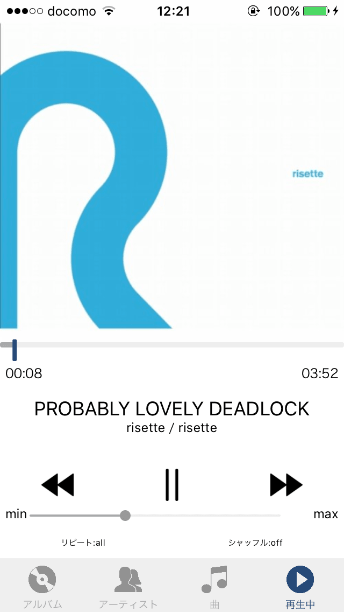

# SimpleMusicPlayer

その他キャプチャ

- [アルバム一覧](https://raw.githubusercontent.com/leader22/SimpleMusicPlayer/master/docs/album.png)
- [アーティスト一覧](https://raw.githubusercontent.com/leader22/SimpleMusicPlayer/master/docs/artist.png)
- [すべての曲](https://raw.githubusercontent.com/leader22/SimpleMusicPlayer/master/docs/songs.png)
- [アルバム詳細](https://raw.githubusercontent.com/leader22/SimpleMusicPlayer/master/docs/album2.png)

## What
いまはなきiOS7時代のシンプルな音楽プレーヤーです。

- アルバム一覧
- アーティスト一覧
- すべての曲
- プレーヤー
  - 再生・一時停止
  - 曲送り
  - 曲戻し
  - シーク
  - ボリューム調整
  - リピート切替（なし・1曲・全曲）
  - シャッフル切替（なし・あり）
  - バックグラウンド再生

これ以上の機能はありません。

## なおせなかったバグ
- **なぜか**再生できないアルバムがある

## 見送った機能
- [sw] ボリューム二度押しで曲送り
  - そんなイベントは手の届くところになさそう
  - iOSから学んでがっちりSwift書けばいけそう
- [sw] アプリ終了で音を止める
  - そんなイベントは手の届くところになさそう
  - iOSから学んでがっちりSwift書けばいけそう
- [js] そのタブを表示中にそのタブを押すとそのタブのトップに
  - refでもNavigatorに届かなかったのでコンポーネントでイベント拾うとかしないと無理そう
